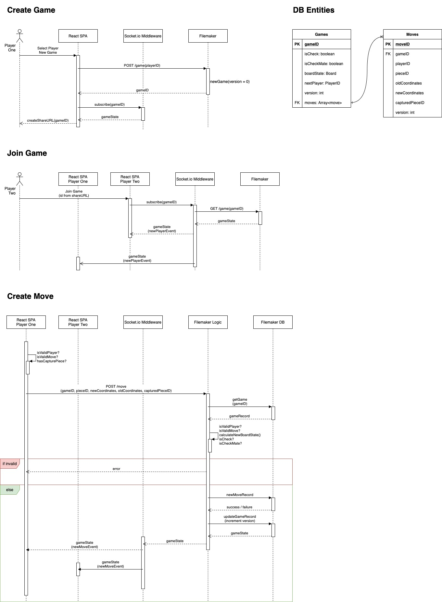

# Introduction

A proof-of-concept to create a two player, replayable, real-time chess game using the following components:

- A web-based UI written in the React framework
- A Socket.io middleware to enable real-time web-based communication
- A Filemaker Pro database and REST API for storing game state

# Specification

- Apply chess rules to the game, see: https://en.wikipedia.org/wiki/Rules_of_chess
- Two player game in remote web browsers
- Drag & drop interface
- Front end move validation (to provide immediate user feedback)
- Details of each move changeset should be save so that the board can be replayed, with a versioned board state history. Replaying each move from an empty state, should always product the same final board state
- Only the latest current state of the board is stored (to minimise storage requirements)

# Responsibilities

## UI (validation logic)

- Enable creation of new games
- Create share Link for new games to enable second player to join (e.g. https://jeudechec/join/<gameID>)
- Provide drag and drop interface for the board
- Handle new board updates pushed from Socket.io and update the UI
- Provide validation for legal moves
- Does NOT calculate whether board is in a check or checkmate state

## Socket.io Middleware (Real-time communication)

- Enable subscription to game updates using a game ID
- Provide an endpoint for Filemaker Pro to push new game events (new moves, new game, new player etc.)

## Filemaker Pro (business logic)

- Create new game
- Store latest game state
- Store history of all move changesets
- Validate moves
- Calculate if board is currently in a state of check or checkmate

# Key Sensitive Information

- Which move or moves will lead to check or checkmate
- Which move or moves will prevent check or checkmate

# Security

- To prevent cheating, web application should never hold or be able to calculate sensitive information
- API should not 'leak' sensitive information

# Custom Types

```
PlayerID: white | black
BoardColumn: Array<pieceID, 8>
Board: {
  a: BoardColumn
  b: BoardColumn
  ...
  h: BoardColumn
}
Coordinates: [RowLetter (string, a - h), ColumnNumber(int, 0 - 8)]
```

# Entities

## Game

| Index | Field       | Type            |
| ----- | ----------- | --------------- |
| PK    | gameID      | `string`        |
| FK    | moves       | `Array<moveID>` |
|       | boardState  | `Board`         |
|       | isCheck     | `boolean`       |
|       | isCheckMate | `boolean`       |
|       | nextPlayer  | `PlayerID`      |
|       | version     | `int`           |

### Relations

One `Game` to Zero or Many `Moves`

## Move

| Index | Field           | Type          |
| ----- | --------------- | ------------- |
| PK[]  | moveID          | `string`      |
| FK    | gameID          | `string`      |
|       | playerID        | `PlayerID`    |
|       | pieceID         | `string`      |
|       | capturedPieceID | `string`      |
|       | oldCoordinates  | `Coordinates` |
|       | newCoordinates  | `Coordinates` |
|       | version         | `int`         |

### Relations

Zero or Many `Moves` to one `Game`

# Initial Architecture & Sequences



# Algebraic Notation Summary

See: https://en.wikipedia.org/wiki/Algebraic_notation_(chess)

## Pieces

- K for king
- Q for queen
- R for rook
- B for bishop
- N for knight
- Blank for pawns

## Board

- Vertical column = `files`, (a to h)
- Horizontal rows = `ranks`, (1 to 8)

## Moves

Each move of a piece is indicated by the piece's uppercase letter, plus the coordinate of the destination square. For example, Be5 (move a bishop to e5), Nf3 (move a knight to f3). For pawn moves, a letter indicating pawn is not used, only the destination square is given. For example, c5 (move a pawn to c5).

### Captures

When a piece makes a capture, an "x" is inserted immediately before the destination square.

## Structure

Spaces just for readability

- `[Piece] [x === capture] file rank`
